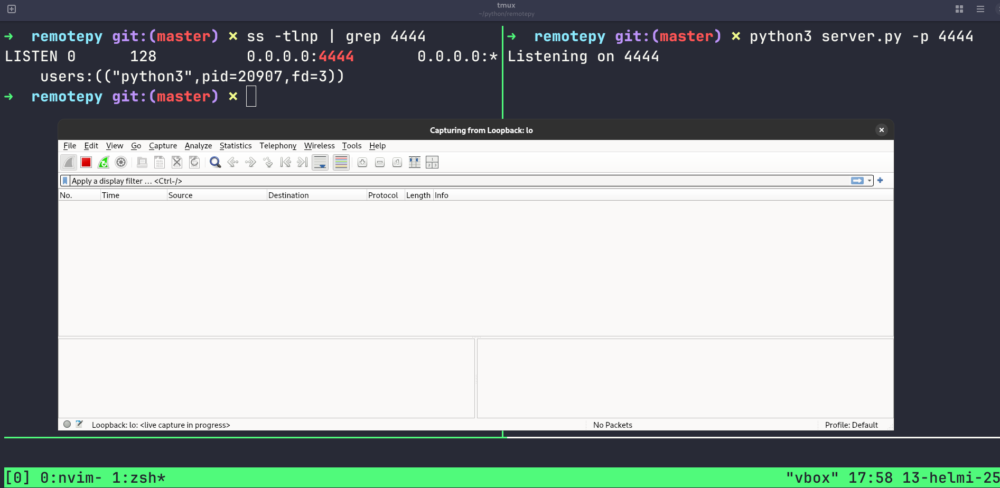
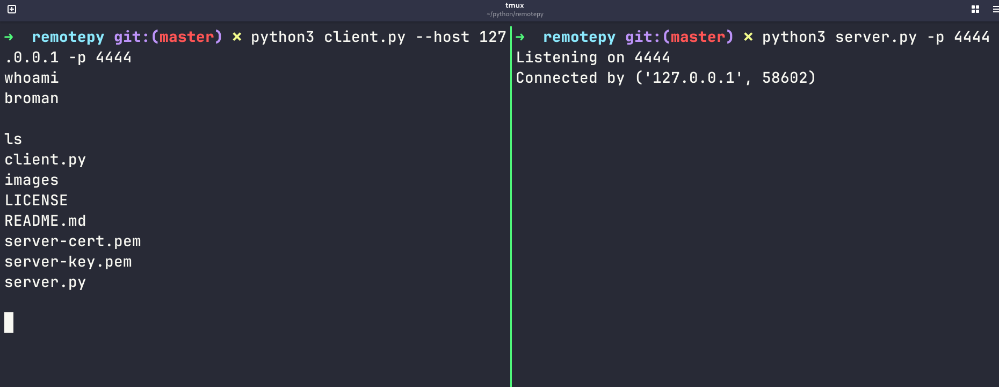
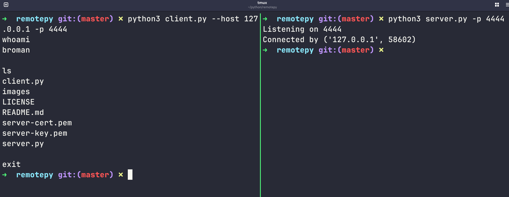
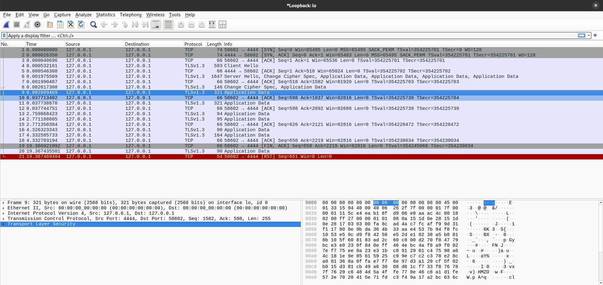
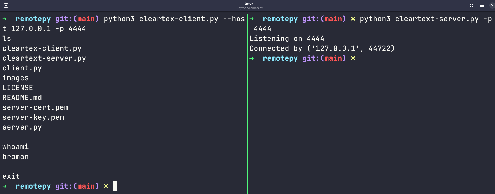
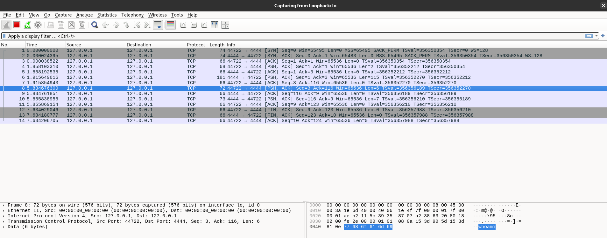
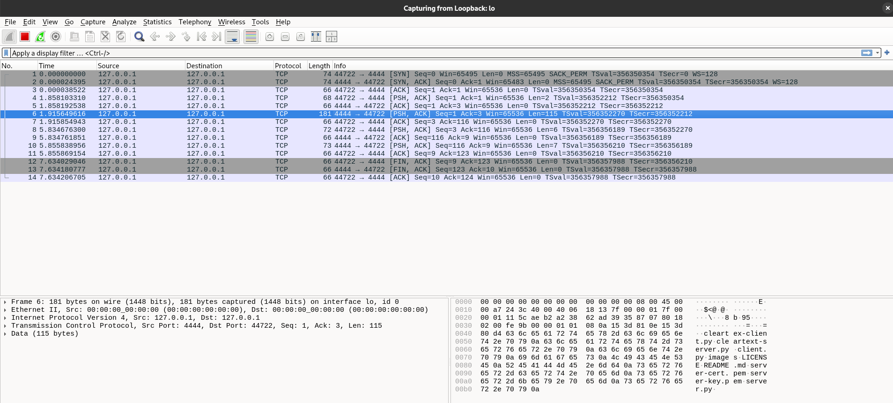

# A trivial remote client/server setup with data encryption using TLS

This fun and experimental little project is really simple. It only supports running commands with output at the moment. Commands like:
- ls
- whoami
- cat

ETC.

I had created these client and server applications a while back. I had the idea of encrypting the data at transfer so I decided to implement it and publish this.

It works with self-signed cert since this is an experimental/educational project. Here's how I created the needed private key and certification:
1. Installed ssl with `sudo dnf install openssl`
2. `openssl genrsa -out server-key.pem 2048`
3. `openssl req -new -x509 -key server-key.pem -out server-cert.pem -days 365`
4. Input some information when it asks. Then you have a certification signed with the private key

# How it works?

Here I have started the server.py application. I have Wireshark listening on loopback and I'm showing that the server.py is really listening on 0.0.0.0:4444 with the ss command.

I used `python3 server.py -p 4444`. I could have used `python3 server.py -l 127.0.0.1 -p 4444` to only listen for connection coming from 127.0.0.1 but here I tested the default 0.0.0.0.

Then I connected to the server with the client.py application `python3 client.py --host 127.0.0.1 -p 4444` and ran some commands.

Like you can see from the image, the output shows in the client not the server.

Here, I gave the exit command to close the connection:

And here's what we see in Wireshark:

As we can see, the data is encrypted.

To show this more, I created temporal cleartex-server.py and cleartex-client.py. I removed the ssl module code from them and demonstrated how it looks like without encryption.

Here, I opened the server, connected to it, ran commands and exited.

Here's the Wireshark capture. We can see the command whoami and other commands in other lines

Here's the response to the ls command:

# DISCLAIMER

This is an experimental product created for educational purposes. Use at your own risk. I'm not to be held accountable should this product cause any harm directly or indirectly.
